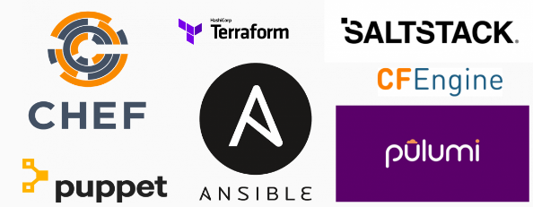

# O que é Infraestrutura como código?

A IaC (Infrastructure as Code), significa basicamente converter sua infraestrutura "tradicional" em código, onde é gerenciada por algum tipo de sistema de controle de versão, por exemplo, Git, e armazenada em um repositório onde você pode gerenciar semelhante à sua aplicação - por exemplo, com controle de versão para rastreabilidade, verificações de revisão, testes.



Abaixo explico alguns conceitos e mostro de forma real alguns exemplos de códigos usando as principais ferramentas de IaC do mercado. Caso você tenha alguma sugestão de melhoria, contribua com o projeto, envie um PR. 

# Ansible

Antes de iniciar o projeto sobre o Ansible, consulte a documentação oficial da ferramenta. [Clique aqui!](https://docs.ansible.com/)

O Ansible pode ser usado para alguns casos de uso, veja alguns exemplos:
- Provisioning;
- Configuration management;
- App deployment;
- Continuous Delivery;
- Orchestration.

Algumas características do Ansible:
- É agentless;
- Desenvolvido em Python;
- Baixa curva de aprendizado;
- Playbooks escritos em formato YaML;
- Possui muitos módulos para executar tasks;
- A comunidade é bem participativa e produzido pela Red Hat.

Na parte de Ansible, pretendo mostrar alguns conceitos sobre a ferramenta (how it works) e alguns playbooks que utilizo no meu dia a dia para automatizar os sistemas Linux.

Abaixo mostro um exemplo de playbooks para atualização do sistema Linux Ubuntu (Debian Based).

#### Exemplos:

```
---
- hosts: local
  tasks: 
    - name: Upgrade all packages to the latest version
      apt:  
        update_cache: yes
        upgrade: yes
    - name: Remove useless packages from the cache
      apt:
        autoclean: yes
    - name: Remove dependencies that are no longer required
      apt:
        autoremove: yes
...
```

Para ajudar nos exemplos e no entendimento, irei destacar alguns artigos que eu escrevi para você acompanhar o processo de trabalho do Ansible:

#### Artigos:

1) Ansible: conheça alguns módulos essenciais para automação. Clique [aqui](https://medium.com/@amaurybsouza/modules-ansible-e62b7849b94c) par acessar.

# Terraform

O objetivo desse projeto é mostrar alguns conceitos importantes e casos de uso do Terraform usando providers como, AWS, Docker, GCP, entre outros. Tudo isso, com resultados reais e ideias da comunidade afim de ajudar quem está começando.

Veja aqui um exemplo básico de utilização do Terraform para provisionamento de uma instância EC2 na AWS.

#### Exemplos:

```
# Configure the AWS Provider
provider "aws" {
  region  = "us-east-1"
  shared_credentials_file = "/home/absouza/.aws/credentials"
  profile = "awsterraform"
}

resource "aws_instance" "modeloteste" {
  ami = "ami-00a208c7cdba991ea"
  instance_type = "t2.micro"
}
```

Agora outro exemplo usando o provider Docker:

```
# Configure the Docker provider
provider "docker" {
  }
# Create a Apache Container
resource "docker_container" "nginx" {
    image = "nginx"
    name = "enginecks"
    ports {
        internal = "80"
        external = "80"
    }
}
# Create a image
resource "docker_image" "nginx" {
    name = "nginx:latest"
}
```

Para ajudar no desenvolvimento, irei destacar alguns artigos que eu escrevi para você acompanhar o processo de trabalho do Terraform.

#### Documentação oficial:

- [Download URL](https://www.terraform.io/downloads.html)
- [AWS Resources](https://www.terraform.io/docs/providers/aws/)
- [List of providers](https://www.terraform.io/docs/providers/index.html)


#### Artigos:

1) (IaC) Parte 1: Criando uma instância EC2 na AWS usando Terraform. Clique [aqui](https://medium.com/@amaurybsouza/terraform-e364f5d31570) para acessar.

2) (Iac) Parte 3: Deploy do container nginx usando o Terraform. Clique [aqui](https://medium.com/@amaurybsouza/iac-parte-3-deploy-do-container-nginx-usando-o-terraform-ce26e4400b69) par acessar.


#### Comandos principais:

Comandos         | Descrição do comando
-----------------|-----------------------------------------------
terraform init   |Initialize a Terraform working directory
terraform plan   |Generate and show an execution plan
terraform apply  |Builds or changes infrastructure
terraform destroy|Destroy Terraform-managed infrastructure
terraform show   |Inspect Terraform state or plan
terraform get    |Download and install modules for the configuration
                 
                 
# Terratest

O Terratest é uma biblioteca Go que facilita a criação de testes automatizados para o seu código de infraestrutura.

[Aqui](https://github.com/gruntwork-io/terratest) a documentação oficial.


